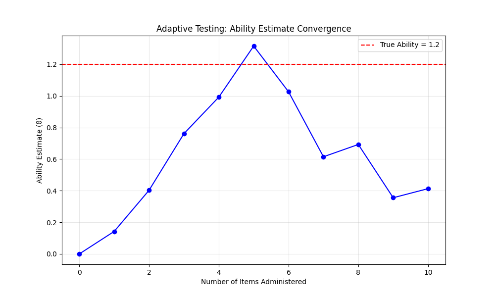

## 🧰 How to Use This Template

Click the green **"Use this template"** button at the top of the page, then choose **"Create a new repository"**.

This will create your own copy of this project, which you can modify freely — no need to fork!

---

<div align="center">
    
</div>

<h1 align="center">Item Response Theory (IRT)</h1>

<p align="center">A practical introduction to Item Response Theory for AI-based adaptive testing</p>

You've likely encountered standardized tests like GRE, GMAT, TOEFL, or IELTS—these aren't just traditional exams, but sophisticated adaptive testing systems that dynamically adjust to your ability level, delivering precise measurements in half the time. This repository explores the mathematical foundation behind these systems: Item Response Theory (IRT), which models the relationship between your ability, question characteristics, and response probabilities. As the world moves toward AI-powered assessment, understanding IRT becomes crucial for building the next generation of intelligent testing systems that combine mathematical rigor with machine learning capabilities.


*Table of Contents*
---
<details>
  <summary><a href="#1-quick-start"><i><b>1. Quick Start</b></i></a></summary>
  <div>
    &nbsp;&nbsp;&nbsp;&nbsp;&nbsp;&nbsp;&nbsp;&nbsp;&nbsp;&nbsp;<a href="#11-prerequisites">1.1. Prerequisites</a><br>
    &nbsp;&nbsp;&nbsp;&nbsp;&nbsp;&nbsp;&nbsp;&nbsp;&nbsp;&nbsp;<a href="#12-setup-and-run">1.2. Setup and Run</a><br>
    &nbsp;&nbsp;&nbsp;&nbsp;&nbsp;&nbsp;&nbsp;&nbsp;&nbsp;&nbsp;<a href="#13-access-jupyter-in-browser">1.3. Access Jupyter in Browser</a><br>
    &nbsp;&nbsp;&nbsp;&nbsp;&nbsp;&nbsp;&nbsp;&nbsp;&nbsp;&nbsp;<a href="#14-update-environment">1.4. Update Environment</a><br>
  </div>
</details>
&nbsp;

<div>
  &nbsp;&nbsp;&nbsp;&nbsp;<a href="#2-repository-structure"><i><b>2. Repository Structure</b></i></a>
</div>
&nbsp;

<details>
  <summary><a href="#3-learning-path"><i><b>3. Learning Path</b></i></a></summary>
  <div>
    &nbsp;&nbsp;&nbsp;&nbsp;&nbsp;&nbsp;&nbsp;&nbsp;&nbsp;&nbsp;<a href="#31-start-with-multimedia-content">3.1. Start with Multimedia Content</a><br>
    &nbsp;&nbsp;&nbsp;&nbsp;&nbsp;&nbsp;&nbsp;&nbsp;&nbsp;&nbsp;<a href="#33-visual-learning">3.3. Visual Learning</a><br>
    &nbsp;&nbsp;&nbsp;&nbsp;&nbsp;&nbsp;&nbsp;&nbsp;&nbsp;&nbsp;<a href="#34-hands-on-exploration">3.4. Hands-On Exploration</a><br>
  </div>
</details>
&nbsp;

<div>
  &nbsp;&nbsp;&nbsp;&nbsp;<a href="#4-key-takeaways"><i><b>4. Key Takeaways</b></i></a>
</div>
&nbsp;

<div>
  &nbsp;&nbsp;&nbsp;&nbsp;<a href="#5-contact-information"><i><b>5. Contact Information</b></i></a>
</div>
&nbsp;


## 1. Quick Start

### 1.1 Prerequisites
- Docker and Docker Compose installed on your system
- VS Code with Dev Containers extension

### 1.2 Setup and Run

**Step 1: Clone and Navigate**
```bash
git clone <repository-url>
cd IRT_Item-Response-Theory
```

**Step 2: Build and Run Container**
```bash
# Make start.sh executable (if not already)
chmod +x start.sh

# Build and run the container
./start.sh
```

**Alternative method:**
```bash
docker-compose up --build -d
```

**Step 3: Verify Container**
```bash
docker-compose ps
```
Ensure the container status is "Up" and port 8888 is mapped.

**Step 4: Run Python Scripts**

```bash
# First, find your container name
docker-compose ps

# Enter the container and navigate to scripts directory
docker exec -it <container_name> bash
cd /app/scripts

# Run scripts one by one
python generate_irt_data.py
python example_irt_simulation.py
```

**Step 5: Work with Jupyter Notebooks**

1. **Attach VS Code to Container:**
   - Press `Ctrl+Shift+P` to open command palette
   - Select `Dev Containers: Attach to Running Container…`
   - Choose your project container
   - In the new VS Code window, click "Open Folder" → select `/root/app`
   - Install extensions: Docker, Dev Containers, Python, and Jupyter

2. **Select Kernel and Run Notebooks:**
   - Open `notebooks/1_IRT_Data_Generator.ipynb` or `notebooks/2_IRT_Exploratory_Analysis.ipynb`
   - Select the correct kernel (should auto-detect)
   - Start exploring IRT concepts by running cells!

**Step 6: Stop Container**
```bash
docker-compose down
```

### 1.3 Access Jupyter in Browser
Visit `localhost:8888/tree` to access Jupyter interface directly.

### 1.4 Update Environment
To rebuild with changes:
```bash
docker-compose up --build
```

To update dependencies:
```bash
# Inside container
pip freeze > requirements.txt
```

## 2. Repository Structure

```
.
├── docs/                    # Documentation and visualizations
│   └── README.md            # Conceptual overview of IRT
├── data/                    # Data for IRT examples
│   └── README.md            # Dataset documentation
├── scripts/                 # Python implementation
│   ├── generate_irt_data.py # Generate synthetic IRT data
│   ├── example_irt_simulation.py # Core IRT simulation
│   └── README.md            # Script documentation
├── requirements.txt         # Python dependencies
└── README.md                # This file
```

## 3. Learning Path

> **📁 All multimedia content is available in the `docs/` folder. You can browse the files directly or use the links below to access them.**

### 3.1 Start with Multimedia Content

**🎥 Video Presentation** - Watch the comprehensive overview:
- [📁 IRT Video Presentation](docs/IRT-Video-Presentation.mp4) - Complete introduction to IRT concepts

**🎧 Audio Discussion** - Listen to expert insights:
- [📁 IRT Audio Conversation](docs/IRT-Audio-Conversation.m4a) - Deep dive into IRT applications

**📚 Technical Documentation** - Read the detailed materials:
- [IRT Conceptual Overview](docs/IRT-Conceptual-Overview.md) - Mathematical foundations
- [IRT Technical Notes](docs/IRT-Technical-Notes.pdf) - Advanced psychometric theory

### 3.3 Visual Learning

**📊 Key Visualizations** - See IRT concepts in action:

<div align="center">
  
  <p><em>Item Characteristic Curves showing how difficulty, discrimination, and guessing parameters affect response probabilities</em></p>
</div>

<div align="center">
  
  <p><em>Adaptive testing simulation showing how ability estimates converge toward true ability</em></p>
</div>

### 3.4 Hands-On Exploration

**Step 1: Conceptual Foundation**
- Read `docs/README.md` for a structured overview of IRT
- Examine the data structure described in `data/README.md`

**Step 2: Interactive Learning**
- Run the example scripts and review their output
- Explore the code in `scripts/example_irt_simulation.py` to see IRT in action
- Experiment by modifying parameters and observing the effects

**Step 3: Advanced Analysis**
- Work through the Jupyter notebooks for comprehensive analysis
- Generate your own IRT datasets and visualizations
- Apply IRT concepts to your own research questions

## 4. Key Takeaways

After exploring this repository, you should understand:

- How IRT models the relationship between ability and item performance
- The meaning and impact of item parameters (difficulty, discrimination, guessing)
- How adaptive tests select items to maximize measurement precision
- The basic mathematics behind IRT probability functions
- How to simulate responses based on IRT models

## 5. Contact Information

For questions not addressed in the resources above, please connect with [Mostafa Rezaee](https://www.linkedin.com/in/mostafa-rezaee/) on LinkedIn for personalized assistance.
